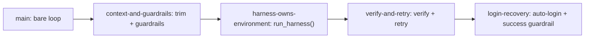
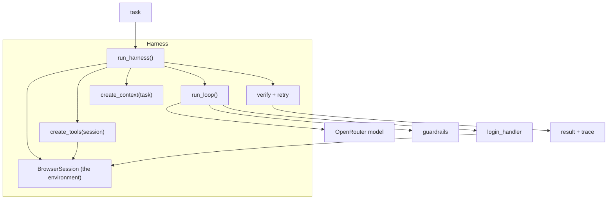
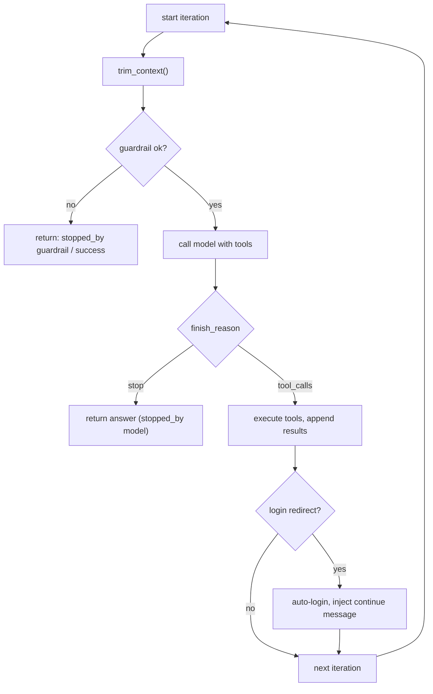
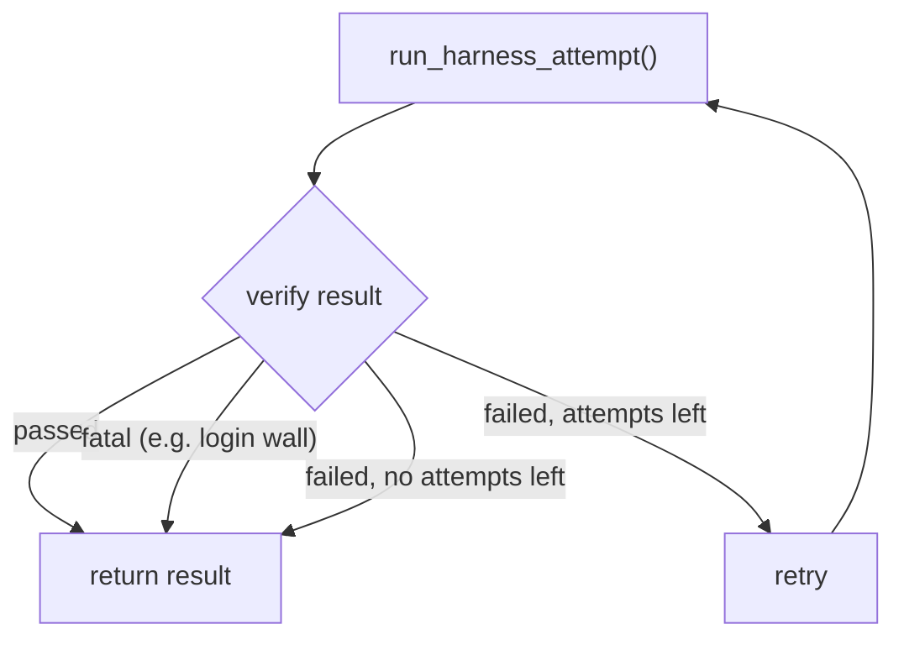

# Architecture

Visual companion to the [README](README.md). These diagrams show what an agent
harness is made of and how the pieces fit together at runtime.

## The branch ladder

Each branch adds exactly one capability. Read a branch, then `git diff` to the
next to see that capability in isolation.

## The harness owns the environment

`run_harness()` is the owner: it opens the browser, binds the tools to it,
builds the context, runs the loop, verifies the outcome, and always closes the
browser. Tools never touch the browser lifecycle -- the harness does.

## One loop iteration

Before every model call the loop trims context and checks the guardrail. The
model either answers (done) or asks for tools; tools run, results are fed back,
and the optional login handler can recover from a redirect before looping again.

## Verify and retry

Guardrails catch *structural* failures (looping, context bloat). Verify catches
*wrong answers* -- a loop can finish "successfully" having done the wrong thing.
A failed verify retries the whole task, unless the failure is fatal.

